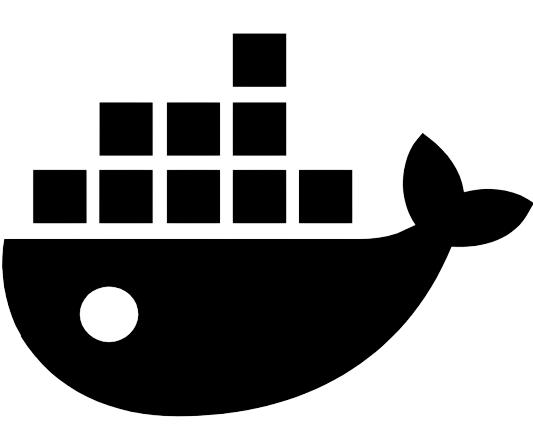

###### <h1 style="text-align: center;"> Telegram Assistant with ChatGPT  </h1>

<h2>Full-Stack Project:</h2>

The <b>Telegram Assistant with ChatGPT </b> project is an Angular and Java-based application developed using the Bootstrap, 
Spring Boot and Spring Security frameworks as well as Telegram and ChatGPT API. 
It integrates with a Telegram bot and uses the ChatGPT model to provide services over Telegram. 
It also provides a web interface for administrators to manage user interactions.

<h2 >Workfrow:</h2>

<h2>Key Features:</h2>
<ol>
<li>
Telegram and ChatGPT API Integration:
<ul><li>The application includes a Telegram bot that communicates seamlessly with ChatGPT.</li></ul>
</li>
<li>
Web Interface for Administrators:
<ul><li>Registration and login functionality for administrators only.</li></ul>
<ul><li>An intuitive web interface allows administrators to view chat logs between the Telegram bot and clients.</li></ul>
<ul><li>Administrators can search and sort user messages and bot responses directly from the web interface.</li></ul>
</li>
<li>
Security:
<ul><li>JWT (JSON Web Token) and Spring Security to enforce access restrictions on the web interface,  
to ensure secure administrator authentication.</li></ul>
</li>
</ol>

<h2>Backend API:</h2>
<ul>
<li>
 <b>Java</b>
</li>
<li>
 <b>Spring Boot</b>
</li>
<li>
 <b>Spring Security</b>
</li>
<li>
 <b>Spring Data JPA</b>
</li>
<li>
 <b>PostgreSQL</b>
</li>
<li>
 <b>Telegram API</b>
</li>
<li>
 <b>ChatGPT API</b>
</li>
<li>
 <b>Swagger</b>
</li>
<li>
 <b>Docker</b>
</li>
<li>
 <b>Lombok</b>
</li>
<li>
 <b>MapStruct</b>
</li>
</ul>
<h5>Description:</h5>
<ol>
<li>Uses Spring Data JPA for simplified data access and persistence.</li>
<li>The PostgreSQL database is employed to store chat histories securely.</li>
<li>Integrates Swagger for API documentation, providing a clear and accessible reference for developers.</li></ul>
<li>The frontend is developed with JavaScript, TypeScript, HTML, and Sass.</li>
</ol>

## API Endpoints 
### 1. Admin Login
- **Endpoint**: `/admin/login`
- **Method**: `POST`
- **Description**: Authenticate an admin and generate a JWT token for authorization.
### 2. Admin Registration
- **Endpoint**: `/admin/register`
- **Method**: `POST`
- **Description**: Register a new admin, returning the created admin along with a generated JWT token.
### 3. Get All Users
- **Endpoint**: `/admin/user`
- **Method**: `GET`
- **Description**: Retrieve a list of users with optional pagination and sorting parameters.
### 4. Get User Chat History
- **Endpoint**: `/admin/user/chat-history`
- **Method**: `GET`
- **Description**: Retrieve the chat history of a specific user with optional pagination and sorting parameters.
### 5. Get User Chat History
- **Endpoint**: `/admin/chatGPT`
- **Method**: `GET`
- **Description**: Initiate a chat with the GPT model by providing a prompt.

<h2>Frontend UI:</h2>
<ul>
<li>
 <b>JavaScript</b>
</li>
<li>
 <b>TypeScript</b>
</li>
<li>
 <b>Bootstrap</b>
</li>
<li>
 <b>JWT (JSON Web Token)</b>
</li>
<li>
 <b>Angular</b>
</li>
<li>
 <b>HTML</b>
</li>
<li>
 <b>Sass</b>
</li>
</ul>

<h5>Description:</h5>
<ol>
<li>The Website UI is implemented as a RESTful application, 
offering flexibility using the Angular and Bootstrap frameworks.</li>
<li>Developed secure login and registration form for admins.</li>
<li>Developed a secure form for management user requests and bot responses.</li>
<li>The frontend is developed with JavaScript, TypeScript, HTML, and Sass.</li>
</ol>

## UI Endpoints 
### 1. Main page
- **Endpoint**: `/admin/main`
- **Description**: Display main description application page.
### 2. Login and registration page
- **Endpoint**: `/admin/login`
- **Method**: `POST`
- **Description**: Authenticate an admin and generate a JWT token for authorization.
### 3. Content page
- **Endpoint**: `/admin/content`
- **Method**: `GET`
- **Description**: Display list of users for registered or authenticating admins with optional pagination and sorting parameters.
### 4. Chat histories page
- **Endpoint**: `/admin/user/chat-history`
- **Method**: `GET`
- **Description**: Display list of chat histories of specified users for registered or authenticating admins with optional pagination and sorting parameters.

## Project Setup
1. Clone the repository to your local machine:
   `git clone https://github.com/ViktorBykh/telegram-assistant-with-chatgpt.git`
2. Open the project in your preferred IDE (e.g., IntelliJ IDEA or VS Code).
3. Configure your PostgreSQL database settings in the file `application.properties` in 
`backend/src/main/resources/application.properties`.
4. Configure the file `.env.sample` -> make it `.env`
6. Build and run the project.

## Swagger Documentation 
API requests are documented using Swagger.
You can access the Swagger UI to explore and test the API endpoints by navigating to:
`http://localhost:8080/swagger-ui/index.html#/`

## Docker 
Docker is supported for this project. You can build a Docker image and run the application in a container.
To use the Docker image, follow these steps:

1. Ensure you have Docker installed or:
   [Install Docker](https://docs.docker.com/get-docker/)
2. Clone this repository:
   `https://github.com/ViktorBykh/telegram-assistant-with-chatgpt.git`
3. Start the Docker container using Docker Compose:
   `docker-compose up`
4. Access the program in a Postman:
   `http://localhost:8080/`
5. Access to the program for Swagger:
   `http://localhost:8080/swagger-ui/index.html#/`
6. Access to the program for Frontend UI:
      `http://localhost:4200/`

This commands will compose Docker image for the Telegram Assistant with ChatGPT and run it.
