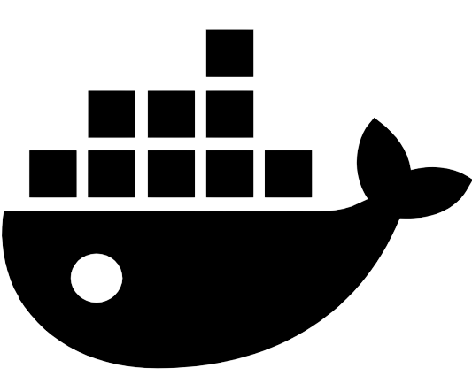

###### <h1 style="text-align: center;">  Backend API  </h1>

## Technologies Used:
<ul>
<li>
 <b>Java</b>
</li>
<li>
 <b>Spring Boot</b>
</li>
<li>
 <b>Spring Security</b>
</li>
<li>
 <b>Spring Data JPA</b>
</li>
<li>
 <b>PostgreSQL</b>
</li>
<li>
 <b>Telegram API</b>
</li>
<li>
 <b>ChatGPT API</b>
</li>
<li>
 <b>Swagger</b>
</li>
<li>
 <b>Docker</b>
</li>
<li>
 <b>Lombok</b>
</li>
<li>
 <b>MapStruct</b>
</li>
</ul>
<h5>Description:</h5>
<ol>
<li>Uses Spring Data JPA for simplified data access and persistence.</li>
<li>The PostgreSQL database is employed to store chat histories securely.</li>
<li>Integrates Swagger for API documentation, providing a clear and accessible reference for developers.</li></ul>
<li>The frontend is developed with JavaScript, TypeScript, HTML, and Sass.</li>
</ol>

## API Endpoints 
### 1. Admin Login
- **Endpoint**: `/admin/login`
- **Method**: `POST`
- **Description**: Authenticate an admin and generate a JWT token for authorization.
### 2. Admin Registration
- **Endpoint**: `/admin/register`
- **Method**: `POST`
- **Description**: Register a new admin, returning the created admin along with a generated JWT token.
### 3. Get All Users
- **Endpoint**: `/admin/user`
- **Method**: `GET`
- **Description**: Retrieve a list of users with optional pagination and sorting parameters.
### 4. Get User Chat History
- **Endpoint**: `/admin/user/chat-history`
- **Method**: `GET`
- **Description**: Retrieve the chat history of a specific user with optional pagination and sorting parameters.
### 5. Get User Chat History
- **Endpoint**: `/admin/chatGPT`
- **Method**: `GET`
- **Description**: Initiate a chat with the GPT model by providing a prompt.
